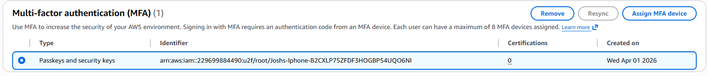
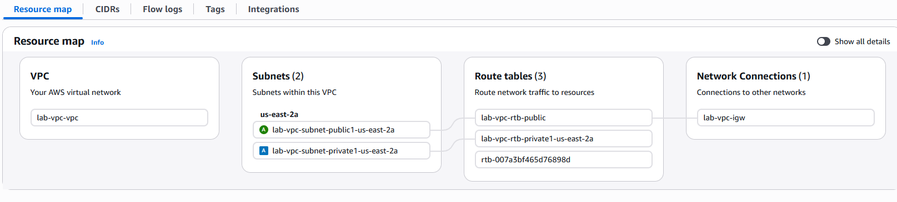
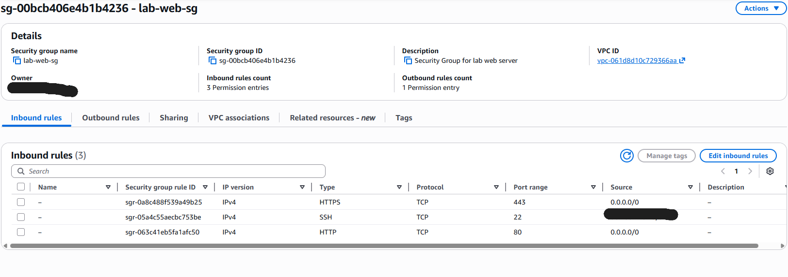
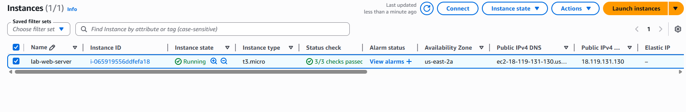
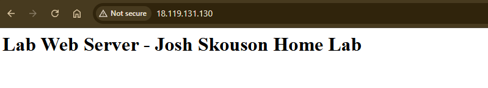
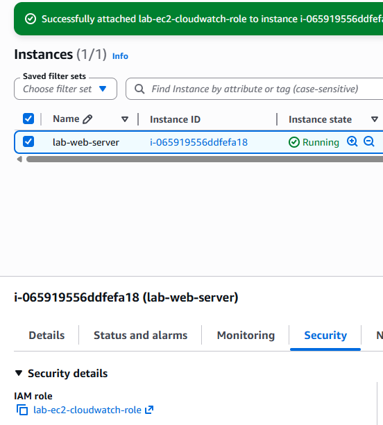
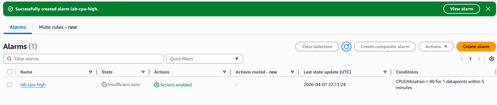

# AWS Cloud Infrastructure Lab

## Overview
Deployed a cloud infrastructure project on AWS using the free tier, demonstrating hands-on experience with core AWS services including VPC networking, EC2 compute, IAM security, and CloudWatch monitoring. This project complements my AWS Cloud Practitioner certification with practical, real-world implementation.

## What This Demonstrates
- AWS VPC design including public and private subnet architecture
- EC2 instance deployment with automated configuration via user data
- Security group configuration following principle of least privilege
- IAM role creation and instance profile attachment
- CloudWatch alarm configuration and SNS notification setup
- AWS account security best practices — MFA, IAM users, root account protection
- Cloud cost awareness and billing monitoring
- Real-world cloud infrastructure documentation

## Environment
- **Cloud Provider:** Amazon Web Services (AWS)
- **Region:** us-east-2 (Ohio)
- **Instance Type:** t3.micro (free tier eligible)
- **Account Security:** MFA enabled on root account, IAM user for all operations

## Steps Completed

### 1. Account Security & IAM Setup
- Enabled MFA on root account using authenticator app
- Created IAM user `josh-admin` with AdministratorAccess policy
- Disabled root account for day-to-day use — all work performed through IAM user
- Applied principle of least privilege from initial account setup

   

### 2. VPC & Network Architecture
- Created `lab-vpc` using VPC and more wizard
- Configured CIDR block `10.0.0.0/16`
- Deployed one public subnet and one private subnet in us-east-2a
- Configured route tables — public subnet routed through internet gateway
- Attached internet gateway `lab-vpc-igw` for external connectivity
```
VPC: 10.0.0.0/16
├── Public subnet: lab-vpc-subnet-public1-us-east-2a
│   └── Route: 0.0.0.0/0 → Internet Gateway
└── Private subnet: lab-vpc-subnet-private1-us-east-2a
    └── Route: local only
```



### 3. Security Group Configuration
- Created `lab-web-sg` security group attached to lab-vpc
- Configured inbound rules following principle of least privilege:
  - SSH (port 22) — restricted to personal IP only, not open to the world
  - HTTP (port 80) — open to all (0.0.0.0/0) for web serving
  - HTTPS (port 443) — open to all (0.0.0.0/0) for secure web serving
- Default outbound rule — all traffic allowed
- Restricting SSH to a specific IP rather than 0.0.0.0/0 demonstrates real security awareness — a common misconfiguration in cloud environments



### 4. EC2 Instance Deployment
- Launched `lab-web-server` EC2 instance in public subnet
- AMI: Amazon Linux 2023 (free tier eligible)
- Instance type: t3.micro
- Attached `lab-web-sg` security group
- Configured user data script to automatically install and start Apache on launch
- Verified web server accessible from public internet via instance public IP
```bash
#!/bin/bash
yum update -y
yum install -y httpd
systemctl start httpd
systemctl enable httpd
echo "<h1>Lab Web Server - Josh Skouson Home Lab</h1>" > /var/www/html/index.html
```




### 5. IAM Role & Least Privilege Access
- Created IAM role `lab-ec2-cloudwatch-role` with trusted entity: EC2
- Attached `CloudWatchAgentServerPolicy` — grants only the permissions needed for CloudWatch, nothing more
- Attached role to `lab-web-server` instance
- Verified role attachment in EC2 security details



### 6. CloudWatch Monitoring & Alerting
- Created `lab-cpu-high` CloudWatch alarm monitoring EC2 CPU utilization
- Alarm triggers when CPUUtilization exceeds 80% for 1 datapoint within 5 minutes
- Configured SNS topic `lab-cpu-alert` to send email notification on alarm state
- Actions enabled — alert will fire automatically without manual intervention



## Skills Demonstrated
- AWS VPC design and subnet architecture
- Internet gateway and route table configuration
- EC2 instance deployment and configuration
- User data scripts for automated instance setup
- Security group configuration and least privilege access
- IAM role creation and EC2 instance profile attachment
- CloudWatch alarm creation and SNS notification setup
- AWS account security — MFA, IAM users, root account protection
- Cloud cost awareness and monitoring best practices
- Public cloud infrastructure documentation

## What I Learned
Building this AWS infrastructure connected my Cloud Practitioner certification knowledge to real hands-on implementation. Understanding the difference between a VPC, subnet, route table, and internet gateway in theory is very different from actually configuring them and watching traffic flow correctly.

The security group configuration was particularly valuable — restricting SSH to my specific IP rather than allowing it from anywhere (0.0.0.0/0) is a simple but critical security decision that many developers get wrong. In a real cloud environment an open SSH port is one of the most common attack vectors, and seeing exactly how to lock it down makes the concept concrete in a way that studying for a cert doesn't.

Creating the IAM role and attaching it to the EC2 instance rather than embedding credentials directly in the instance demonstrated why IAM roles exist — the instance can call AWS services securely without any hardcoded keys that could be exposed. This is the correct pattern used in production environments.

The CloudWatch alarm ties directly to the Digital Operations and monitoring concepts I've been studying — setting thresholds, configuring notifications, and automating responses to infrastructure events is exactly what production operations teams do at scale.

## Important Notes
- All resources are within AWS free tier limits
- EC2 instance should be stopped when not in use to preserve free tier hours
- Billing alerts configured as best practice for cost management
- SSH key pair stored securely and not committed to version control

## Next Steps
- Configure HTTPS with SSL certificate using AWS Certificate Manager
- Add an Application Load Balancer in front of the EC2 instance
- Deploy Wazuh SIEM agent to collect EC2 logs centrally
- Explore AWS Systems Manager for instance management without SSH
