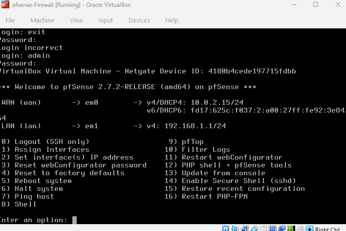
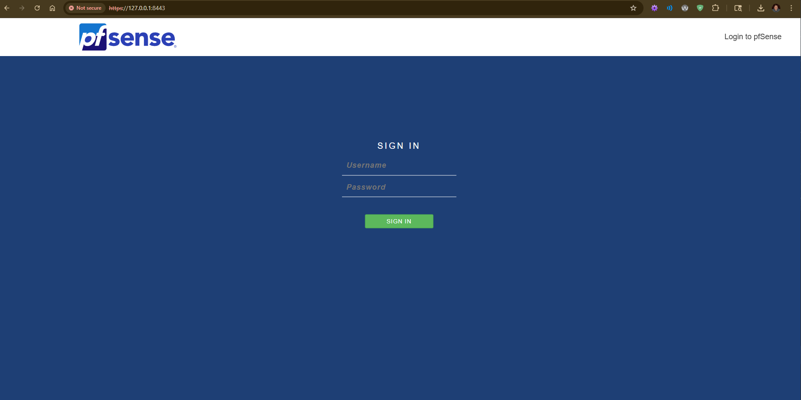
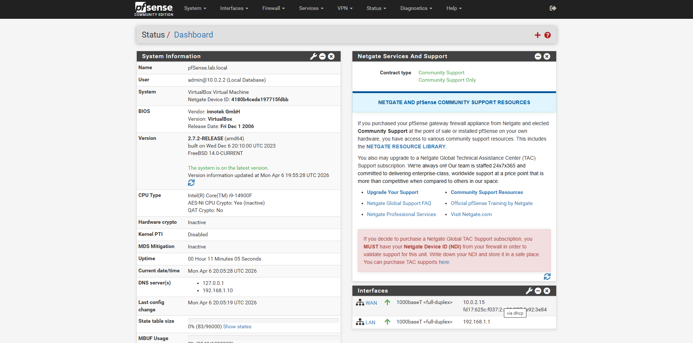
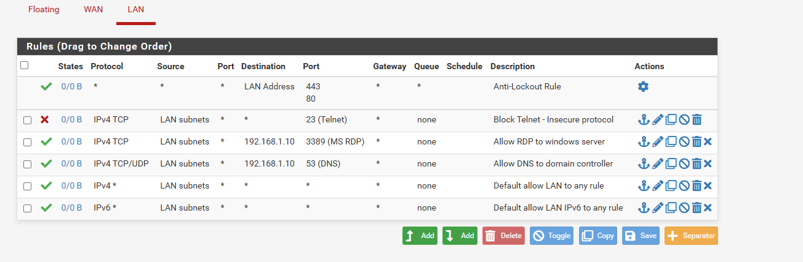
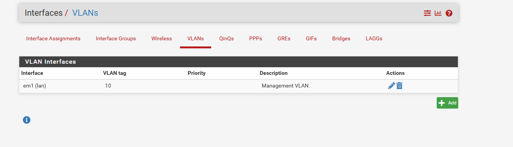
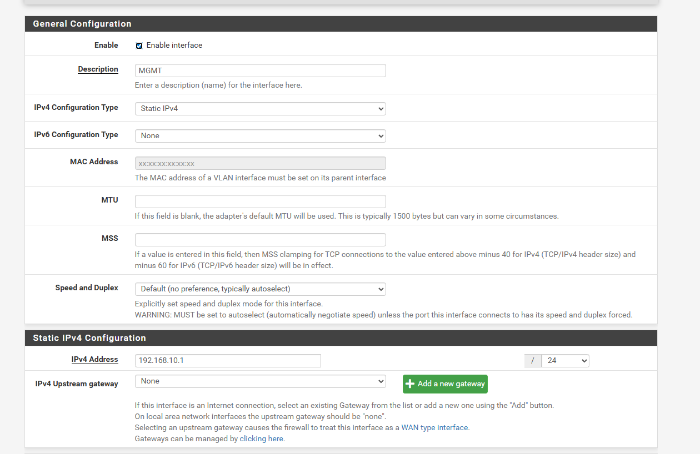
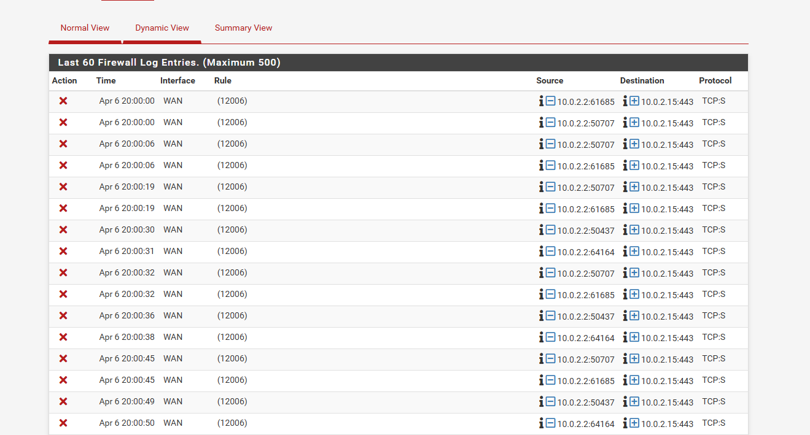

# pfSense Firewall Lab

## Overview
Deployed pfSense 2.7.2 Community Edition in VirtualBox as a virtual firewall and router for the home lab environment. Configured WAN and LAN interfaces, created custom firewall rules enforcing least privilege network access, implemented VLAN segmentation, and enabled traffic logging — simulating a real enterprise perimeter firewall setup.

## Environment
- **OS:** pfSense 2.7.2-RELEASE (FreeBSD 14.0)
- **Hypervisor:** VirtualBox (Windows host, 32GB RAM)
- **Resources:** 1GB RAM, 1 CPU, 10GB dynamic storage
- **WAN Interface:** em0 — NAT (10.0.2.15/24)
- **LAN Interface:** em1 — Internal Network (192.168.1.1/24)
- **Web GUI Access:** https://127.0.0.1:8443 via VirtualBox port forwarding

## Steps Completed

### 1. pfSense Installation & Interface Configuration
- Downloaded pfSense CE 2.7.2 ISO from official mirror
- Created VirtualBox VM with BSD/FreeBSD 64-bit configuration
- Configured two network adapters — NAT (WAN) and Internal Network (LAN)
- Completed installation via FreeBSD installer with GPT partitioning
- Verified automatic interface assignment on first boot:
  - WAN (em0) → 10.0.2.15/24 via DHCP
  - LAN (em1) → 192.168.1.1/24 static



### 2. Web GUI Access & Initial Setup
- Configured VirtualBox port forwarding (host 8443 → guest 443) to access pfSense web GUI from Windows host
- Enabled WAN GUI access via shell command to allow management through port forward
- Completed setup wizard:
  - Hostname: `pfsense`
  - Domain: `lab.local`
  - Primary DNS: `192.168.1.10` (Windows Server domain controller)
  - Changed default admin password to strong credentials
- Verified dashboard showing both interfaces active and system healthy




### 3. Firewall Rules Configuration
Created custom firewall rules on the LAN interface following the principle of least privilege — only explicitly allowed traffic is permitted, everything else follows default deny:

- **Block Telnet (port 23)** — explicitly blocks the insecure legacy remote access protocol across the entire LAN subnet
- **Allow RDP to Windows Server** — permits Remote Desktop Protocol (port 3389) only to `192.168.1.10`, not to all hosts
- **Allow DNS to Domain Controller** — permits DNS queries (port 53 TCP/UDP) only to `192.168.1.10`, ensuring domain resolution goes through the AD-integrated DNS server
- Default allow LAN to any rule retained for general internet access
- Anti-lockout rule protecting web GUI access
```
Block  | LAN subnets → any            | Port 23  (Telnet)
Allow  | LAN subnets → 192.168.1.10   | Port 3389 (RDP)
Allow  | LAN subnets → 192.168.1.10   | Port 53  (DNS)
```



### 4. VLAN Segmentation
- Created VLAN 10 on the LAN interface (em1) for network segmentation
- Description: `Management VLAN` — isolates management traffic from general LAN traffic
- Assigned VLAN 10 as a new interface `MGMT`
- Configured static IP `192.168.10.1/24` on the MGMT interface
- This separates management plane traffic onto its own subnet — a standard enterprise security practice




### 5. Traffic Logging & Monitoring
- Enabled packet logging on custom firewall rules
- Verified live firewall log showing real-time blocked and allowed traffic
- Log shows WAN interface actively blocking unsolicited inbound connection attempts from `10.0.2.2` (host machine) — demonstrating pfSense functioning as a real perimeter firewall
- Log entries include timestamp, interface, source IP, destination IP, and protocol for each event



## Skills Demonstrated
- pfSense installation and initial configuration
- Network interface assignment (WAN/LAN)
- VirtualBox network adapter configuration for firewall deployment
- Web GUI access via port forwarding
- Firewall rule creation and ordering
- Principle of least privilege applied to network access control
- VLAN creation and interface assignment
- Static IP configuration on VLAN interface
- Network segmentation concepts
- Firewall traffic logging and monitoring
- Perimeter firewall concepts — blocking unsolicited inbound traffic
- Integration with existing lab infrastructure (DNS pointing to AD domain controller)

## What I Learned
Deploying pfSense made the abstract concept of network security zones concrete. Having a dedicated firewall VM sitting between my lab systems means traffic has to be explicitly permitted — nothing gets through by accident. This is the foundational principle behind every enterprise network I will ever work on.

Configuring the firewall rules in the correct order was a practical lesson in how rule processing works — firewalls evaluate rules top to bottom and stop at the first match. Placing the Block Telnet rule before the default allow rule means Telnet traffic gets dropped before it can match the general permit, regardless of destination. This kind of rule ordering logic is tested on the Security+ exam but becomes genuinely intuitive when you configure it yourself.

The VLAN segmentation exercise showed me why enterprises separate traffic into zones — a management VLAN on its own subnet means management traffic is isolated from user traffic, reducing the blast radius of a compromise. Even in a small lab environment the principle is identical to what a network engineer would implement in a data center.

The firewall log was the most visually compelling part of this project — watching pfSense silently block dozens of unsolicited inbound connection attempts in real time demonstrated exactly why perimeter firewalls exist. Every red X in that log is a connection that never reached the internal network.

## Network Architecture
```
Internet
    |
[WAN - em0 - 10.0.2.15]
    |
[pfSense Firewall - 192.168.1.1]
    |
[LAN - em1 - 192.168.1.0/24]
    |
    ├── Windows Server 2022 (192.168.1.10) — Domain Controller, DNS, DHCP
    ├── Ubuntu Server 22.04 (192.168.1.50) — Linux server, domain member
    └── MGMT VLAN 10 (192.168.10.0/24) — Management traffic isolation
```

## Next Steps
- Install Wazuh SIEM agent to collect pfSense firewall logs centrally
- Configure pfSense to forward syslog to Wazuh manager
- Add additional firewall rules as lab complexity grows
- Explore pfSense IDS/IPS features using Snort or Suricata package
