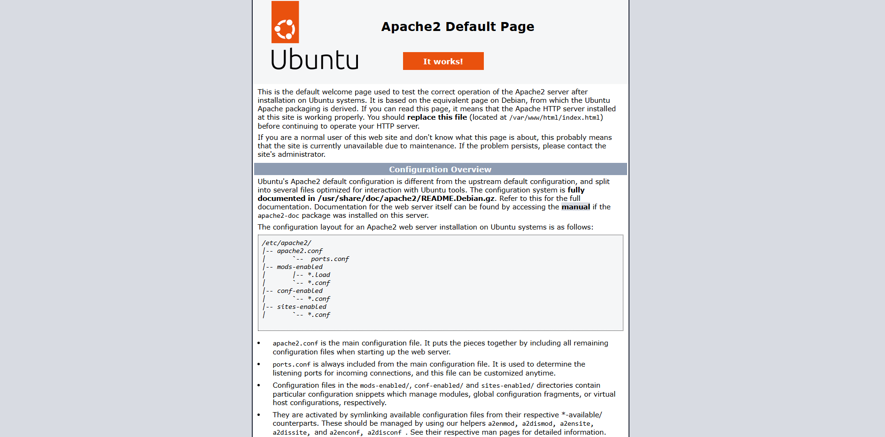
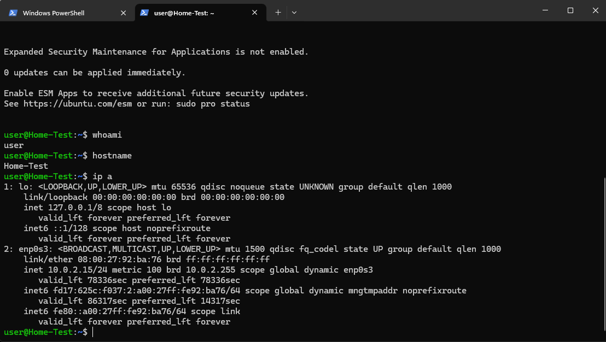
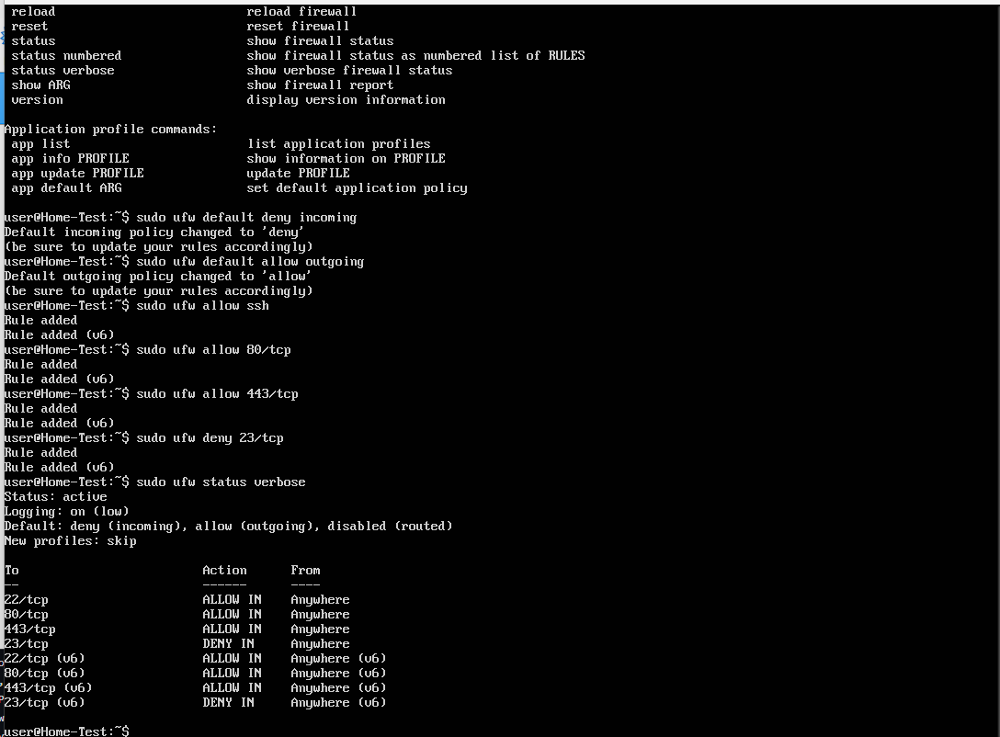
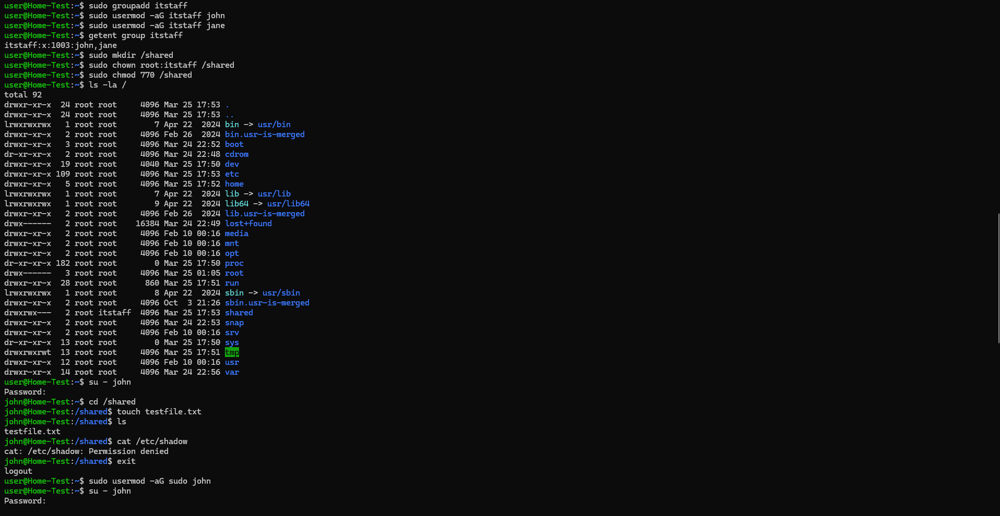
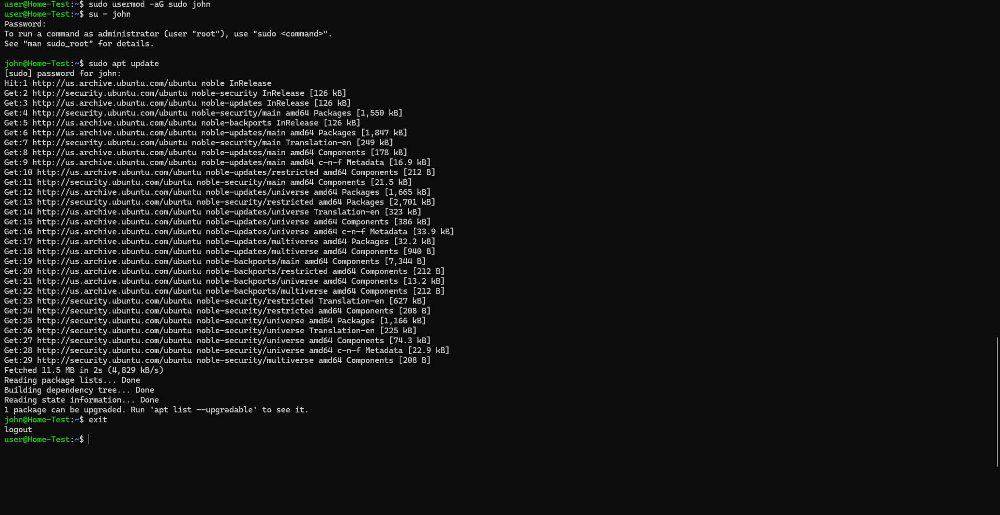
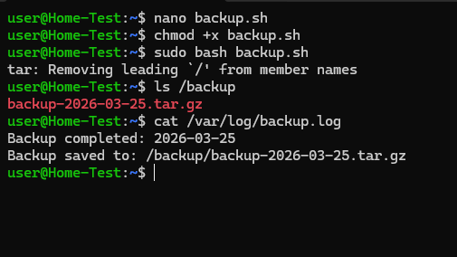
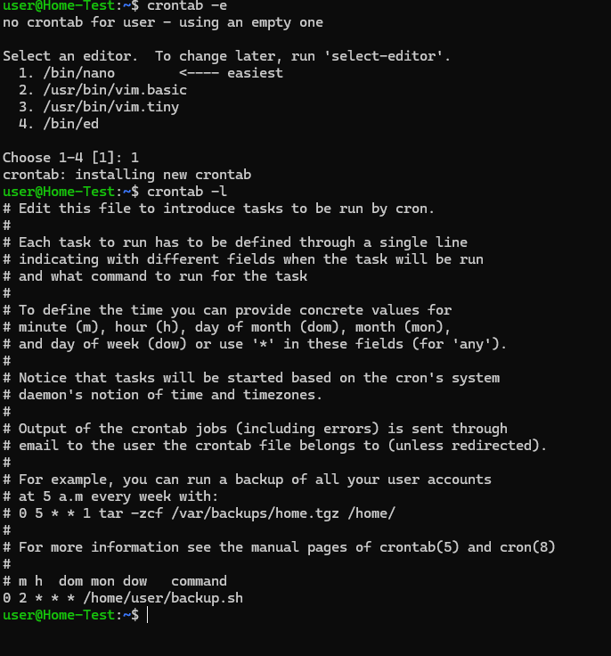
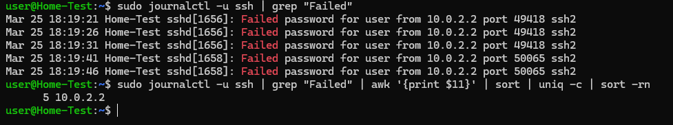
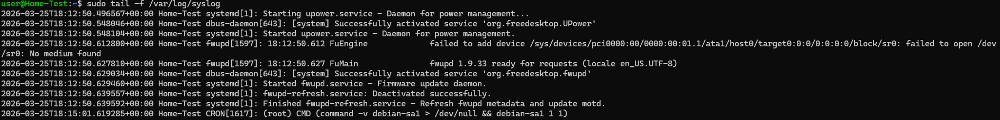

# Ubuntu Server Lab

## Overview
Deployed Ubuntu Server 22.04 LTS in VirtualBox as the foundation 
of a self-built home lab environment. This project simulates a 
basic enterprise Linux server setup covering web services, remote 
administration, and firewall security.

## Environment
- **OS:** Ubuntu Server 22.04 LTS
- **Hypervisor:** VirtualBox (Windows host, 32GB RAM)
- **Network:** NAT with port forwarding

## Steps Completed

### 1. Installation & Initial Setup
- Downloaded Ubuntu Server 22.04 LTS ISO and created a VM in VirtualBox
- Allocated 2GB RAM, 2 CPUs, 25GB dynamic storage
- Completed server installation with OpenSSH enabled
- Updated all system packages via apt
```bash
sudo apt update && sudo apt upgrade -y
```

### 2. Apache Web Server
- Installed and configured Apache HTTP server
- Configured VirtualBox port forwarding (host 8080 → guest 80)
- Verified web server accessible from host machine browser
```bash
sudo apt install apache2 -y
sudo systemctl status apache2
```



### 3. SSH Remote Access
- Configured VirtualBox port forwarding (host 2222 → guest 22)
- Connected to the server remotely from Windows host via PowerShell
- Verified remote administration without needing the VirtualBox console
```bash
ssh user@127.0.0.1 -p 2222
```



### 4. UFW Firewall Configuration
- Enabled UFW with default deny incoming policy
- Whitelisted only necessary ports: SSH (22), HTTP (80), HTTPS (443)
- Explicitly blocked Telnet (port 23) — an insecure legacy protocol
- Verified rules with verbose status output
```bash
sudo ufw enable
sudo ufw default deny incoming
sudo ufw default allow outgoing
sudo ufw allow ssh
sudo ufw allow 80/tcp
sudo ufw allow 443/tcp
sudo ufw deny 23/tcp
sudo ufw status verbose
```



### 5. User & Permission Management
- Created users `john` and `jane` to simulate employee onboarding
- Created `itstaff` group and assigned both users to it
- Created `/shared` directory owned by `itstaff` group with `770` permissions
- Verified non-group members cannot access restricted directories
- Granted `john` sudo privileges, leaving `jane` as a standard user
- Demonstrated role-based access control (RBAC) principles
```bash
sudo adduser john
sudo adduser jane
sudo groupadd itstaff
sudo usermod -aG itstaff john
sudo usermod -aG itstaff jane
sudo mkdir /shared
sudo chown root:itstaff /shared
sudo chmod 770 /shared
sudo usermod -aG sudo john
```




### 6. Bash Scripting & Cron Automation
- Written a bash script to automatically back up the Apache web 
  directory (`/var/www/html`) and log the result
- Script creates a timestamped `.tar.gz` archive in `/backup`
- Appends a completion entry to `/var/log/backup.log` on every run
- Scheduled the script to run automatically daily at 2:00am using cron
```bash
#!/bin/bash
DATE=$(date +%F)
SOURCE="/var/www/html"
DEST="/backup"
LOGFILE="/var/log/backup.log"

mkdir -p $DEST
tar -czf $DEST/backup-$DATE.tar.gz $SOURCE
echo "Backup completed: $DATE" >> $LOGFILE
echo "Backup saved to: $DEST/backup-$DATE.tar.gz" >> $LOGFILE
```




### 7. System Monitoring & Log Analysis
- Monitored live system resources using `htop` (CPU, RAM, processes)
- Checked disk usage with `df -h` and `du`
- Monitored memory with `free -h`
- Streamed live system logs with `tail -f /var/log/syslog`
- Investigated failed SSH login attempts using `journalctl`
- Identified attempted usernames ranked by frequency — simulating 
  basic brute force detection
```bash
htop
df -h
free -h
sudo tail -f /var/log/syslog
sudo journalctl -u ssh | grep "Failed"
sudo journalctl -u ssh | grep "Failed" | awk '{print $11}' | sort | uniq -c | sort -rn
```

> **Note:** Ubuntu 22.04 routes SSH logs to the systemd journal rather
> than `/var/log/auth.log` — discovered this through troubleshooting
> and adjusted commands accordingly.





## Skills Demonstrated
- Linux server installation and administration
- Package management with apt
- Web server deployment and configuration
- SSH remote access and port forwarding
- Firewall policy design and implementation
- User and group management
- Role-based access control (RBAC)
- File permissions and least privilege
- Bash scripting and automation
- Task scheduling with cron
- System backup procedures
- System monitoring and resource analysis
- Log analysis and failed login detection
- Troubleshooting and adapting to OS-specific configurations
- VirtualBox VM networking

## What I Learned
Configuring UFW reinforced the principle of least privilege from 
my CompTIA Security+ studies — only allowing exactly what is needed 
and explicitly blocking known insecure protocols. Managing the server 
entirely through SSH mirrors how real production servers are 
administered in enterprise environments.

Working through user and permission management made the concept of 
role-based access control (RBAC) click in a practical way. Creating 
groups, assigning users, and setting directory permissions with chmod 
and chown showed me how enterprises control who can access what at 
the filesystem level. Seeing a permission denied error on a restricted 
file — and understanding exactly why it was denied — was more valuable 
than any multiple choice question on the Security+ exam.

Writing and scheduling the backup script was my first real taste of 
automation thinking — instead of manually running a task, you define 
it once and let the system handle it. Understanding cron syntax also 
gave me a practical answer to a common interview question. Automation 
like this is foundational to both sysadmin and DevOps roles.

During log analysis I discovered that Ubuntu 22.04 routes SSH 
authentication logs to the systemd journal rather than the traditional 
`auth.log` file. Having to troubleshoot this and find the correct 
command reinforced that real IT work rarely goes exactly as documented 
— knowing how to adapt and find solutions is just as important as 
knowing the commands.

## Next Steps
- Integration with Wazuh SIEM for centralized logging
