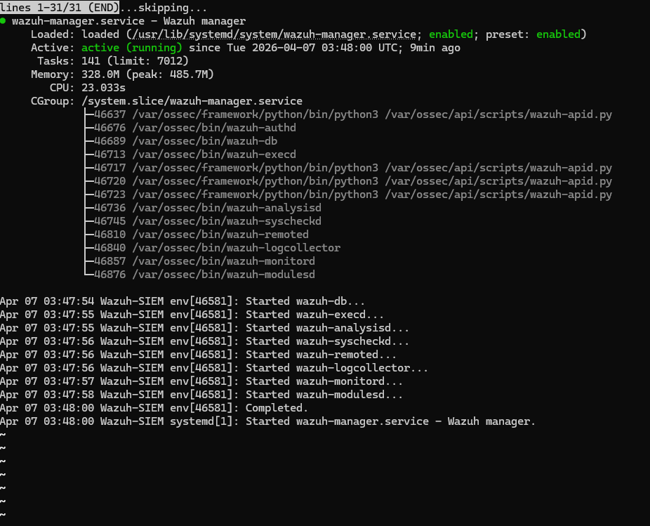
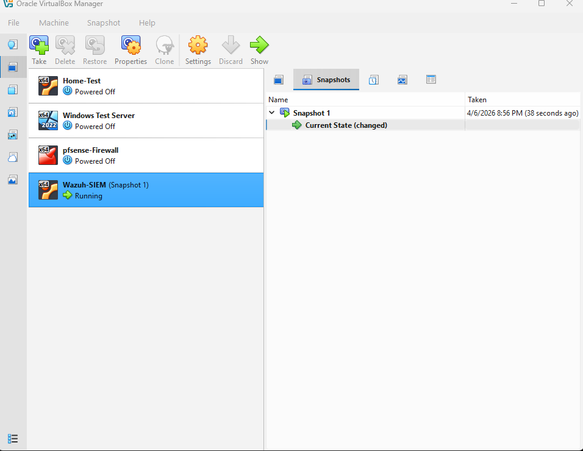
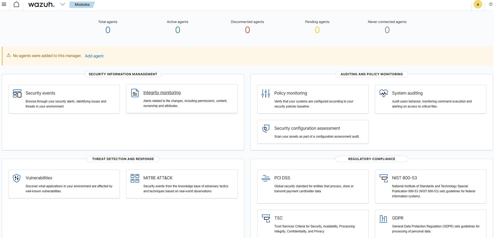
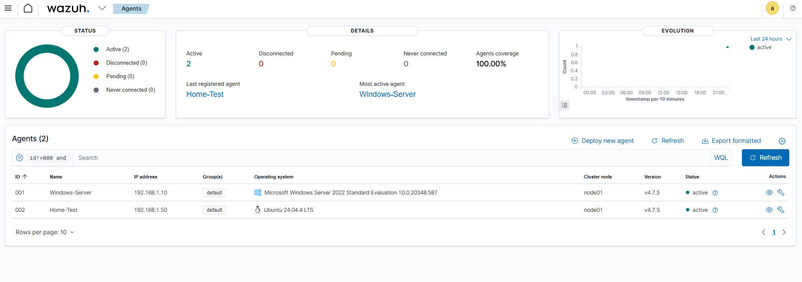
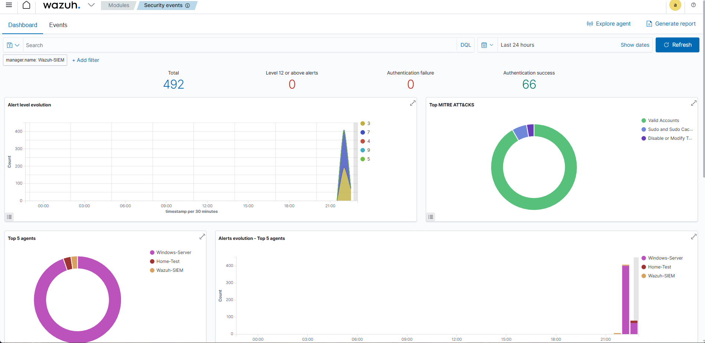
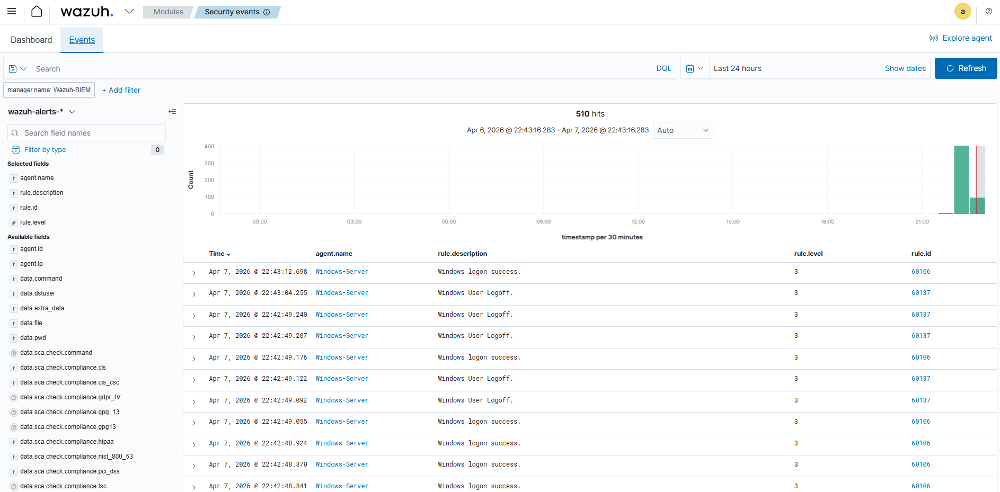
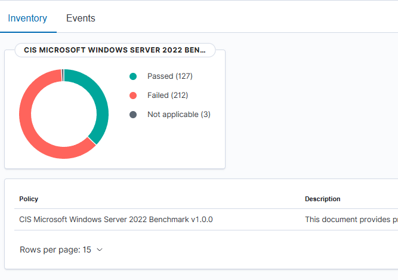

# Wazuh SIEM Lab

## Overview
Deployed Wazuh 4.7.5 as a centralized Security Information and Event Management (SIEM) platform, monitoring the entire home lab environment in real time. Installed agents on both Ubuntu Server and Windows Server, generating and analyzing security alerts, authentication events, and CIS benchmark compliance assessments across all systems simultaneously.

## Environment
- **Wazuh Version:** 4.7.5
- **Wazuh VM OS:** Ubuntu 24.04 LTS
- **Hypervisor:** VirtualBox (Windows host, 32GB RAM)
- **Resources:** 6GB RAM, 4 CPUs, 50GB dynamic storage
- **Wazuh Manager IP:** 192.168.1.20
- **Dashboard Access:** https://127.0.0.1:8444 via VirtualBox port forwarding
- **Agents monitored:**
  - Windows-Server (192.168.1.10) — Windows Server 2022
  - Home-Test (192.168.1.50) — Ubuntu Server 24.04

## Steps Completed

### 1. Wazuh Installation
- Created dedicated Ubuntu VM with 6GB RAM, 4 CPUs, 50GB storage
- Installed Wazuh 4.7.5 using the official all-in-one installer script
- Used `-i` flag to bypass OS compatibility check on Ubuntu 24.04
- Verified all Wazuh services started successfully — manager, indexer, and dashboard
- Configured VirtualBox port forwarding to access dashboard from Windows host
- Took VirtualBox snapshot after successful install as a restore point

```bash
curl -sO https://packages.wazuh.com/4.7/wazuh-install.sh
sudo bash wazuh-install.sh -a -i
```




### 2. Dashboard Access & Overview
- Accessed Wazuh web dashboard at https://127.0.0.1:8444
- Verified all modules available:
  - Security Information Management — Security events, Integrity monitoring
  - Threat Detection and Response — Vulnerabilities, MITRE ATT&CK
  - Auditing and Policy Monitoring — Policy monitoring, System auditing, Security configuration assessment
  - Regulatory Compliance — PCI DSS, NIST 800-53, TSC, GDPR



### 3. Ubuntu Agent Installation
- Added Wazuh repository and GPG key to Ubuntu Server
- Installed wazuh-agent version 4.7.5 to match manager version
- Configured agent to connect to Wazuh manager at 192.168.1.20
- Fixed netplan configuration to make static IP persistent across reboots
- Verified agent active and reporting to manager

```bash
curl -s https://packages.wazuh.com/key/GPG-KEY-WAZUH | sudo gpg --no-default-keyring \
  --keyring gnupg-ring:/usr/share/keyrings/wazuh.gpg --import
sudo apt install wazuh-agent=4.7.5-1 -y
sudo sed -i 's/MANAGER_IP/192.168.1.20/' /var/ossec/etc/ossec.conf
sudo systemctl enable wazuh-agent && sudo systemctl start wazuh-agent
```

### 4. Windows Server Agent Installation
- Downloaded Wazuh agent MSI via VirtualBox shared folder (Windows Server has no direct internet access)
- Installed silently via msiexec with manager IP and agent name configured
- Started WazuhSvc service and verified running status

```powershell
msiexec.exe /i "Z:\wazuh-agent-4.7.5-1.msi" /q WAZUH_MANAGER="192.168.1.20" WAZUH_AGENT_NAME="Windows-Server"
NET START WazuhSvc
Get-Service WazuhSvc
```

### 5. Agent Verification & Monitoring
- Verified both agents active in Wazuh dashboard with 100% agent coverage
- Windows-Server and Home-Test both reporting at v4.7.5
- 492 total security alerts generated across both systems
- 66 authentication successes logged
- MITRE ATT&CK techniques identified — Valid Accounts, Sudo and Sudo Caching, Disable or Modify Tools
- Live event feed showing real-time Windows logon and logoff events





### 6. CIS Benchmark Compliance Assessment
- Wazuh automatically ran CIS Microsoft Windows Server 2022 Benchmark v1.0.0
- Results: 127 passed, 212 failed, 3 not applicable
- Failed checks represent real hardening gaps — missing patches, insecure configurations, and policy gaps that a security team would remediate
- This is the same type of assessment used by real enterprises to measure security posture against industry standards



## Skills Demonstrated
- SIEM deployment and configuration
- Wazuh manager, indexer, and dashboard installation
- Linux and Windows agent deployment
- Cross-platform security monitoring
- Real-time alert analysis and event correlation
- MITRE ATT&CK framework mapping
- CIS benchmark compliance assessment
- Security configuration assessment (SCA)
- Netplan static IP configuration on Ubuntu
- VirtualBox shared folders for file transfer
- Port forwarding for web dashboard access
- Snapshot management for VM restore points
- Authentication event monitoring
- Security event documentation

  ## Troubleshooting & Challenges
- **OS compatibility warning** — Wazuh 4.7.5 installer flagged Ubuntu 24.04 as unsupported. Resolved by using the `-i` flag to bypass the compatibility check — installation completed successfully and all services ran correctly
- **Agent version mismatch** — initial Ubuntu agent installation pulled version 4.14.4 which was higher than the manager version 4.7.5. Wazuh requires agent version to be equal to or lower than the manager. Resolved by explicitly installing `wazuh-agent=4.7.5-1`
- **Ubuntu agent not appearing in dashboard** — agent was installed and running but not connecting to the manager. Root cause was the internal network adapter (enp0s8) being DOWN with no IP assigned. Fixed by configuring netplan to permanently assign 192.168.1.50 to enp0s8
- **Windows Server couldn't download agent** — Windows Server has no direct internet access since it's on the internal network only. Resolved by downloading the MSI on the host machine and transferring it via VirtualBox shared folder
- **Static IP on Ubuntu not surviving reboots** — IP addresses set with `ip addr add` are not persistent. Permanently fixed by editing `/etc/netplan/50-cloud-init.yaml` to include the static IP configuration for enp0s8

## What I Learned
Deploying Wazuh brought everything in the lab together into a single monitoring platform. Seeing alerts from Windows Server and Ubuntu simultaneously — with MITRE ATT&CK technique mapping — made the concept of a SOC dashboard tangible in a way that studying for Security+ never did. Each alert tells a story about what happened on a system, when it happened, and how it maps to known attacker techniques.

The CIS benchmark assessment was particularly eye opening. 212 failed checks on a freshly installed Windows Server 2022 shows that default configurations are not secure configurations. In a real enterprise a security team would work through those failures systematically, prioritizing by severity. Understanding what those failures mean and how to remediate them is foundational SOC analyst work.

Troubleshooting the agent version mismatch between Ubuntu and the Wazuh manager was a valuable real-world lesson — the agent version must be equal to or lower than the manager version, and chasing that error through the logs is exactly the kind of systematic troubleshooting that IT roles require daily. The netplan configuration fix for the static IP also reinforced that changes made with `ip addr add` don't survive reboots — permanent network configuration requires editing the netplan config file directly.

Having all three systems — Ubuntu Server, Windows Server, and the Wazuh manager itself — visible in the dashboard simultaneously represents a complete, functional SOC monitoring environment built entirely from scratch.

## Lab Network with Wazuh
```
Internet
    |
[WAN - pfSense - 10.0.2.15]
    |
[LAN - 192.168.1.0/24]
    |
    ├── Windows Server 2022 (192.168.1.10) — Wazuh Agent v4.7.5
    ├── Ubuntu Server 22.04 (192.168.1.50) — Wazuh Agent v4.7.5
    └── Wazuh SIEM Manager (192.168.1.20) — Dashboard, Indexer, Manager
```

## Next Steps
- Configure pfSense syslog forwarding to Wazuh for firewall log monitoring
- Create custom Wazuh rules for lab-specific alerts
- Explore Wazuh active response for automated threat remediation
- Investigate and remediate CIS benchmark failures on Windows Server
