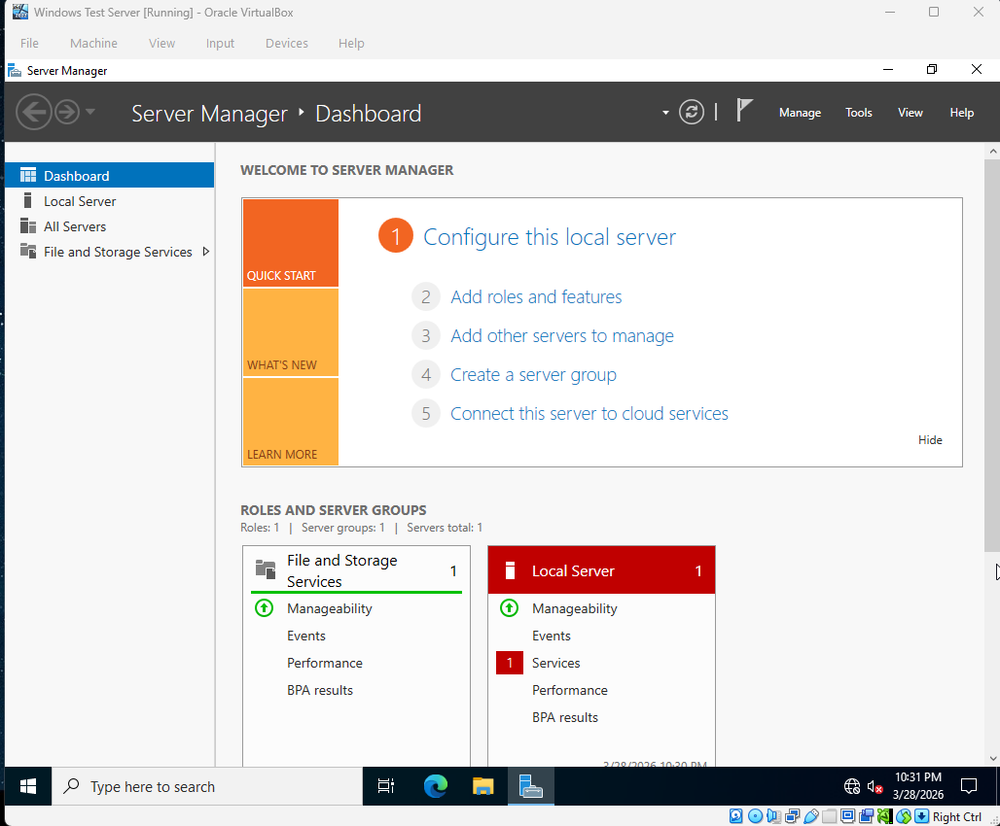
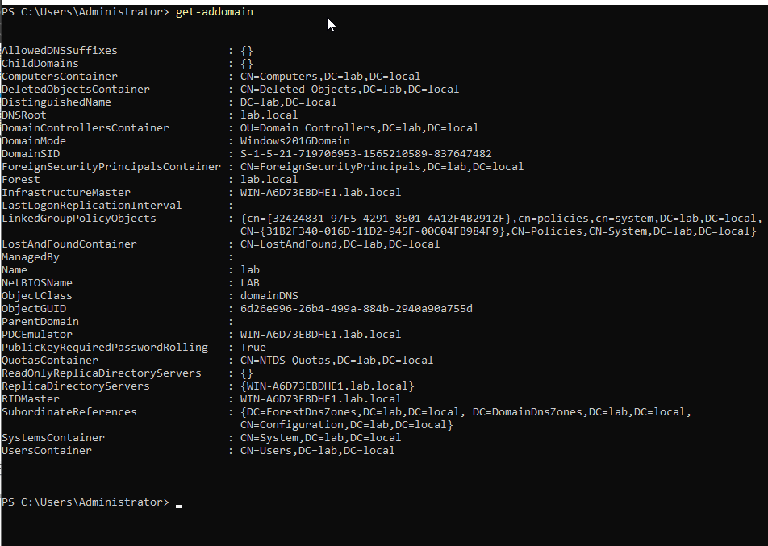
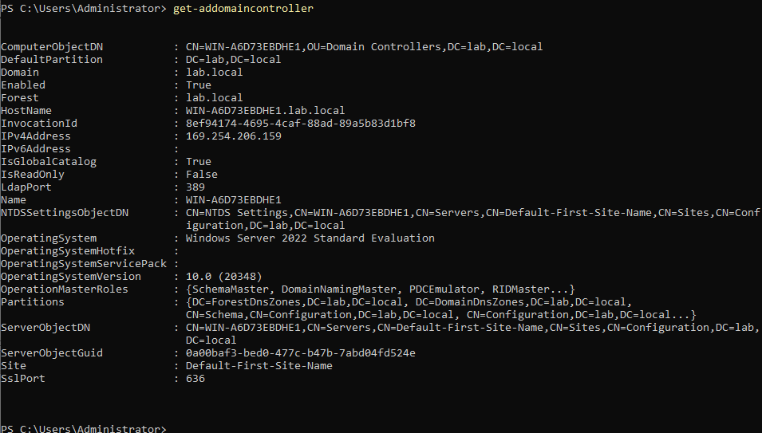
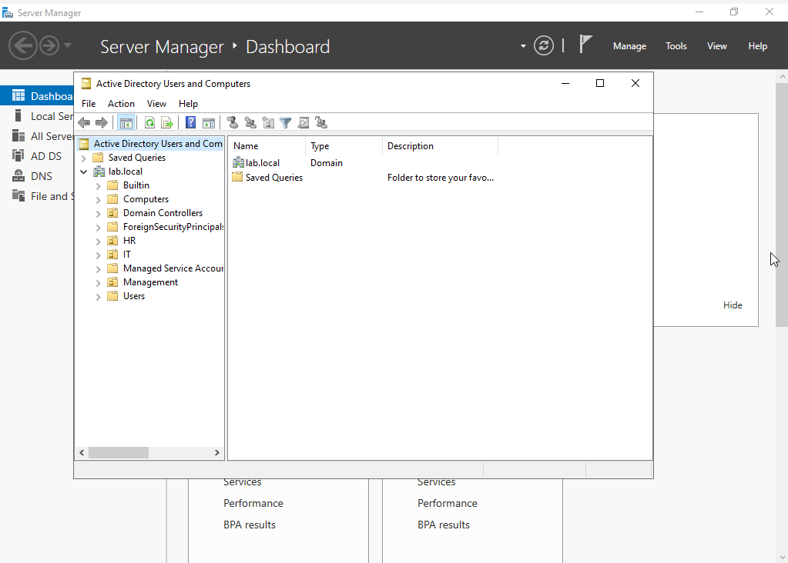
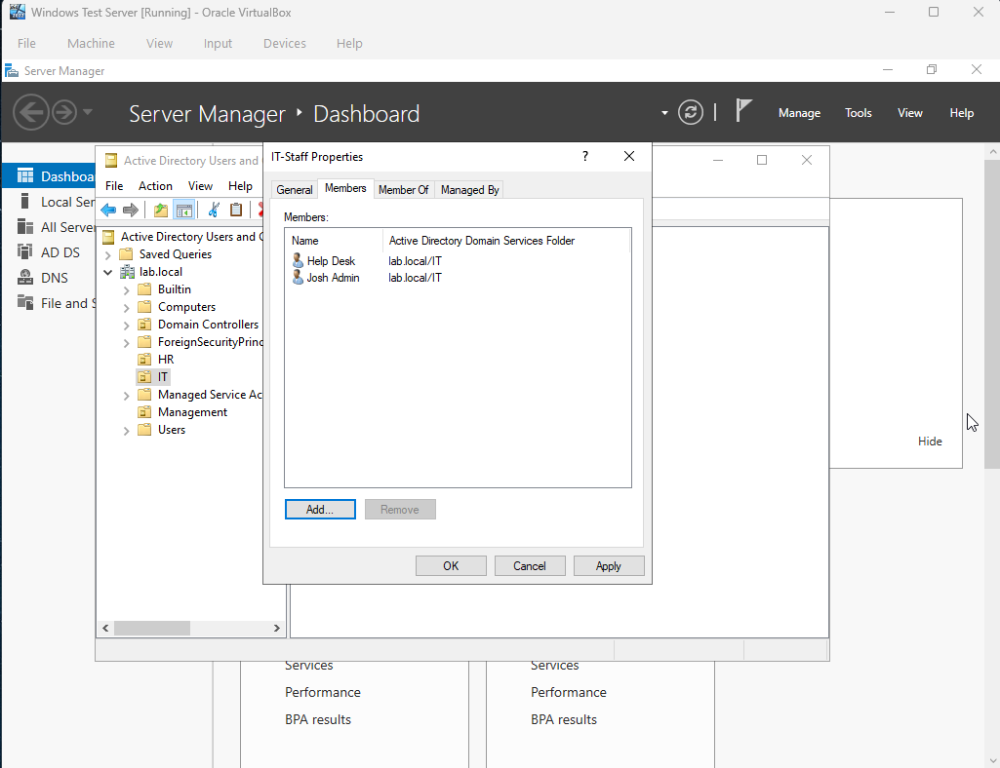
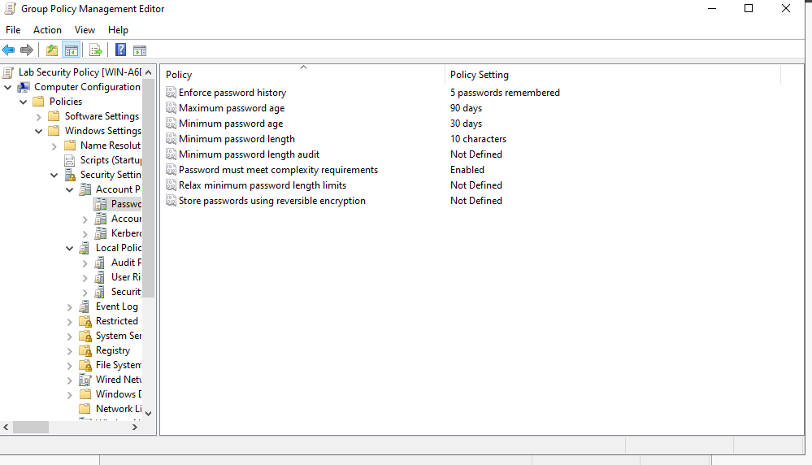
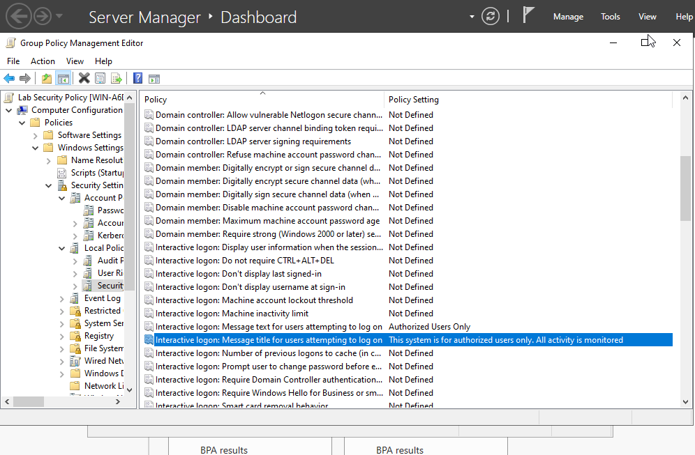

# Windows Server 2022 & Active Directory Lab

## Overview
Deployed Windows Server 2022 in VirtualBox and promoted it to a 
Domain Controller, simulating a real enterprise Active Directory 
environment. Configured organizational structure, user accounts, 
security groups, and Group Policy Objects.

## Environment
- **OS:** Windows Server 2022 Standard Evaluation
- **Hypervisor:** VirtualBox (Windows host, 32GB RAM)
- **Resources:** 6GB RAM, 4 CPUs, 60GB dynamic storage
- **Domain:** lab.local

## Steps Completed

### 1. Windows Server 2022 Installation
- Downloaded Windows Server 2022 Evaluation ISO from Microsoft
- Created VirtualBox VM with 6GB RAM, 4 CPUs, 60GB dynamic disk
- Installed Windows Server 2022 with Desktop Experience (GUI)
- Configured display memory and network adapter settings



### 2. Active Directory Domain Services
- Installed AD DS role via Server Manager → Add Roles and Features
- Promoted server to Domain Controller
- Created new forest with root domain `lab.local`
- Configured DSRM recovery password
- Verified domain controller status via PowerShell
```powershell
Get-ADDomain
Get-ADDomainController
```




### 3. Organizational Units, Users & Groups
- Created three Organizational Units simulating company departments:
  - `IT` — technical staff
  - `HR` — human resources
  - `Management` — leadership
- Created domain user accounts in each OU:
  - `jadmin` (IT) — IT administrator account
  - `helpdesk` (IT) — help desk technician
  - `janehr` (HR) — HR staff member
  - `bmanager` (Management) — department manager
- Created `IT-Staff` security group in the IT OU
- Added `jadmin` and `helpdesk` as members of IT-Staff




### 4. Group Policy Object (GPO)
- Created `Lab Security Policy` GPO linked to lab.local domain
- Configured password policy settings:
  - Minimum password length: 10 characters
  - Maximum password age: 90 days
  - Minimum password age: 30 days (required by Windows when 
    password history is enforced)
  - Enforce password history: 5 passwords remembered
  - Password complexity requirements: Enabled
- Configured interactive logon security banner:
  - Title: `Authorized Users Only`
  - Message: `This system is for authorized use only. 
    All activity is monitored.`




## Skills Demonstrated
- Windows Server 2022 installation and configuration
- Active Directory Domain Services (AD DS) setup
- Domain Controller promotion and forest creation
- Organizational Unit design and management
- Domain user and group account administration
- Security group creation and membership management
- Group Policy Object (GPO) creation and configuration
- Password policy implementation
- Login banner and security messaging via GPO
- PowerShell for AD verification
- VirtualBox VM configuration for Windows environments

## What I Learned
Setting up Active Directory from scratch gave me a deep appreciation 
for how enterprise identity management actually works. Every corporate 
network I'll ever support will have AD at its core — understanding how 
domains, OUs, users, and groups relate to each other is foundational 
knowledge for any IT support or sysadmin role.

Configuring Group Policy was particularly valuable because it 
connected directly to my Security+ knowledge around access control 
and security policy enforcement. The password policy settings I 
configured — complexity requirements, history enforcement, maximum 
age — are real industry standards that organizations use to comply 
with security frameworks like NIST and CIS benchmarks.

The login banner GPO was a small but meaningful detail — in a real 
environment this is a legal requirement in many organizations, 
notifying users that activity is monitored before they authenticate. 
Knowing why these policies exist, not just how to configure them, 
is what separates someone who understands security from someone who 
just follows instructions.

## Next Steps
- Configure DNS zones and records
- Set up DHCP scope for the lab network
- Join Ubuntu Server VM to the lab.local domain
- Install Wazuh SIEM agent to collect Windows event logs
