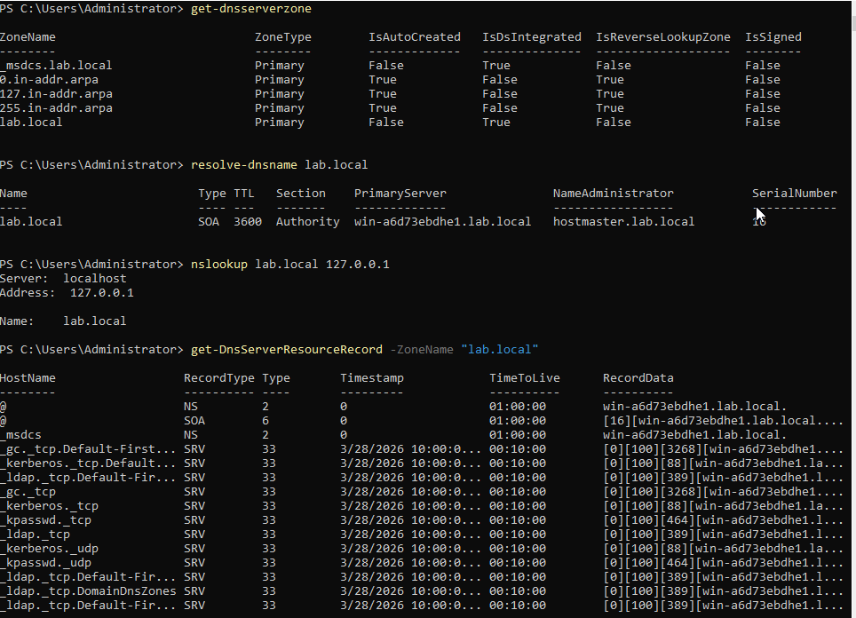
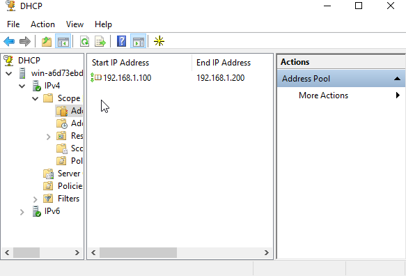
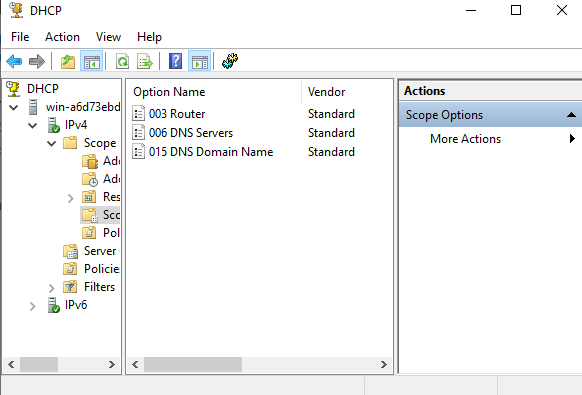
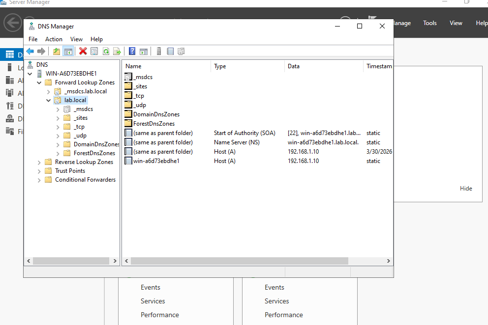
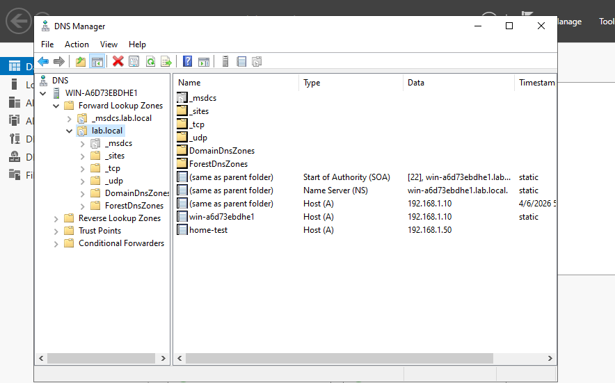
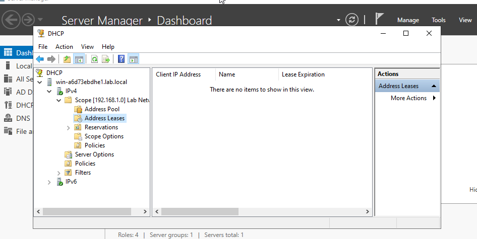
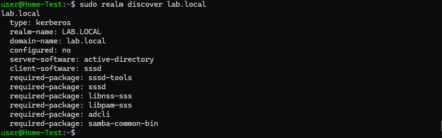
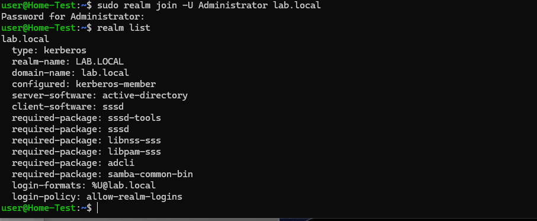
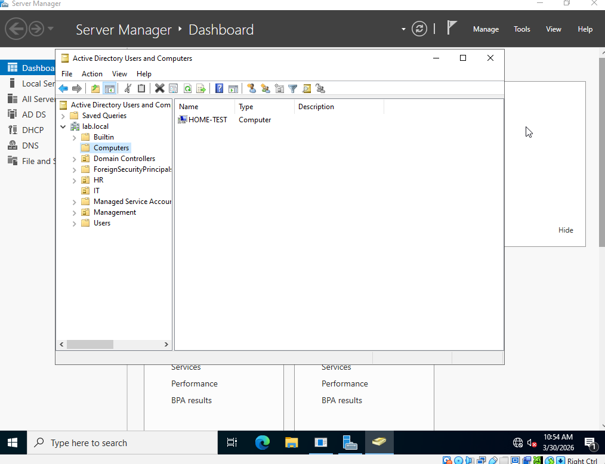
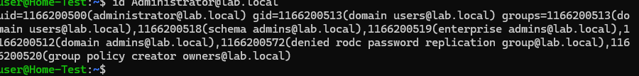

# Windows Server 2022 & Active Directory Lab

## Overview
Deployed Windows Server 2022 in VirtualBox and promoted it to a 
Domain Controller, simulating a real enterprise Active Directory 
environment. Configured organizational structure, user accounts, 
security groups, and Group Policy Objects.

## Environment
- **OS:** Windows Server 2022 Standard Evaluation
- **Hypervisor:** VirtualBox (Windows host, 32GB RAM)
- **Resources:** 6GB RAM, 4 CPUs, 60GB dynamic storage
- **Domain:** lab.local

## Steps Completed

### 1. Windows Server 2022 Installation
- Downloaded Windows Server 2022 Evaluation ISO from Microsoft
- Created VirtualBox VM with 6GB RAM, 4 CPUs, 60GB dynamic disk
- Installed Windows Server 2022 with Desktop Experience (GUI)
- Configured display memory and network adapter settings


### 2. Active Directory Domain Services
- Installed AD DS role via Server Manager → Add Roles and Features
- Promoted server to Domain Controller
- Created new forest with root domain `lab.local`
- Configured DSRM recovery password
- Verified domain controller status via PowerShell
```powershell
Get-ADDomain
Get-ADDomainController
```


### 3. Organizational Units, Users & Groups
- Created three Organizational Units simulating company departments:
  - `IT` — technical staff
  - `HR` — human resources
  - `Management` — leadership
- Created domain user accounts in each OU:
  - `jadmin` (IT) — IT administrator account
  - `helpdesk` (IT) — help desk technician
  - `janehr` (HR) — HR staff member
  - `bmanager` (Management) — department manager
- Created `IT-Staff` security group in the IT OU
- Added `jadmin` and `helpdesk` as members of IT-Staff


### 4. Group Policy Object (GPO)
- Created `Lab Security Policy` GPO linked to lab.local domain
- Configured password policy settings:
  - Minimum password length: 10 characters
  - Maximum password age: 90 days
  - Minimum password age: 30 days (required by Windows when 
    password history is enforced)
  - Enforce password history: 5 passwords remembered
  - Password complexity requirements: Enabled
- Configured interactive logon security banner:
  - Title: `Authorized Users Only`
  - Message: `This system is for authorized use only. 
    All activity is monitored.`


### 5. DNS Configuration & Verification
- Confirmed `lab.local` as a Primary DNS zone integrated with AD
- Verified SOA record and domain controller registration
- Confirmed all Active Directory SRV records present — Kerberos, LDAP, Global Catalog all registered correctly
- Tested DNS resolution using nslookup and PowerShell
```powershell
Get-DnsServerZone
Resolve-DnsName lab.local
nslookup lab.local 127.0.0.1
Get-DnsServerResourceRecord -ZoneName "lab.local"
```



### 6. DHCP Server Configuration
- Installed DHCP Server role via Server Manager
- Authorized DHCP server in Active Directory
- Created `Lab Network` scope covering `192.168.1.100–192.168.1.200`
- Configured scope options:
  - Option 003: Router — `192.168.1.1`
  - Option 006: DNS Server — `192.168.1.10` (domain controller)
  - Option 015: DNS Domain Name — `lab.local`
- Activated scope and verified address pool




### 6b. DNS Records & Dynamic Registration
- Verified forward lookup zone showing all registered hosts in lab.local
- Windows Server domain controller registered at `192.168.1.10`
- Ubuntu Server (HOME-TEST) automatically registered at `192.168.1.50` upon domain join — demonstrating dynamic DNS update working correctly as part of AD membership
- DHCP address leases empty as expected — all lab servers use static IPs, which is correct practice for server infrastructure





### 7. Ubuntu Server Joined to Domain
- Configured Ubuntu Server's internal network adapter with static IP `192.168.1.50` on the lab network
- Pointed Ubuntu DNS to Windows Server at `192.168.1.10`
- Verified network connectivity between VMs via ping
- Installed realm, sssd, adcli, and Kerberos packages on Ubuntu
- Discovered and joined `lab.local` domain using realm join
- Verified domain membership from Ubuntu — `configured: kerberos-member`
- Verified from Windows Server — Ubuntu visible in AD Computers container
- Confirmed cross-platform AD authentication — Ubuntu resolving domain users and their full group memberships from Active Directory
```bash
sudo realm discover lab.local
sudo realm join -U Administrator lab.local
realm list
id Administrator@lab.local
```






## Skills Demonstrated
- Windows Server 2022 installation and configuration
- Active Directory Domain Services (AD DS) setup
- Domain Controller promotion and forest creation
- Organizational Unit design and management
- Domain user and group account administration
- Security group creation and membership management
- Group Policy Object (GPO) creation and configuration
- Password policy implementation
- Login banner and security messaging via GPO
- DNS server configuration and verification
- DHCP scope creation and option configuration
- Static IP assignment on Windows Server
- Linux-Windows domain integration (realm/sssd/Kerberos)
- Cross-platform Active Directory authentication
- PowerShell for AD and network verification
- VirtualBox internal network configuration
- DNS forward lookup zone management
- Manual and dynamic DNS record registration
- Static IP planning for server infrastructure

## What I Learned

Setting up Active Directory from scratch gave me a deep appreciation 
for how enterprise identity management actually works. Every corporate 
network I'll ever support will have AD at its core — understanding how 
domains, OUs, users, and groups relate to each other is foundational 
knowledge for any IT support or sysadmin role.

Configuring Group Policy connected directly to my Security+ knowledge 
around access control and security policy enforcement. The password 
policy settings I configured — complexity requirements, history 
enforcement, maximum age — are real industry standards that 
organizations use to comply with security frameworks like NIST and 
CIS benchmarks.

DNS and DHCP configuration showed me how the two services work 
together in an enterprise environment — DHCP hands out IP addresses 
and tells clients where the DNS server is, DNS resolves hostnames to 
IPs, and Active Directory relies on both to function. Seeing all three 
services working together made the relationship between them click in 
a way that studying for certs alone never did.

Watching Ubuntu automatically register itself in Windows DNS after 
joining the domain was a satisfying moment — it confirmed that the AD 
integration was working at a deeper level than just authentication. In 
a real enterprise environment this is how IT teams track which devices 
are on the network and ensure hostname resolution works correctly 
across all systems. The empty DHCP leases view also reinforced an 
important principle — servers should always use static IPs so their 
addresses never change unexpectedly, while DHCP is reserved for 
client devices like workstations and laptops.

Joining Ubuntu Server to the Windows domain was the most technically 
challenging and rewarding part of this project. Getting a Linux machine 
to authenticate against Windows Active Directory requires understanding 
Kerberos, SSSD, realm discovery, and cross-platform networking 
simultaneously. The fact that Ubuntu could query AD group memberships 
— showing domain admins, schema admins, and enterprise admins — 
confirmed that the integration was complete and working at a production 
level. This is the kind of hybrid environment skill that employers in 
enterprise IT look for and rarely find in entry-level candidates.

## Next Steps
- Install Wazuh SIEM agent on Windows Server to collect event logs centrally
- Install Wazuh SIEM agent on Ubuntu Server for centralized Linux log monitoring
- Configure pfSense to forward firewall logs to Wazuh manager
- Explore Group Policy automation for software deployment across domain
